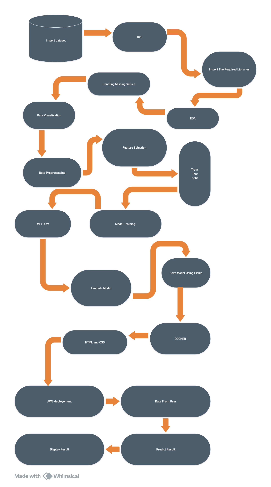

# Mushroom Classification Project

## Problem Statement

The Audubon Society Field Guide to North American Mushrooms describes 23 species of gilled mushrooms in the Agaricus and Lepiota families. Each species is labeled as definitely edible, definitely poisonous, or maybe edible but not recommended. The last category has been merged with the toxic category, emphasizing that there is no simple rule for judging a mushroom's edibility.

## Project Overview

The **Mushroom Classification Project** leverages machine learning techniques to classify mushrooms as either edible or poisonous based on their physical characteristics. This project serves as a practical application of data science and underscores the importance of safety in food consumption.

### Objectives

- Develop a predictive model to classify mushrooms.
- Evaluate multiple machine learning algorithms for optimal performance.
- Implement MLflow for tracking experiments and managing models.
- Deploy the application on AWS using EC2 and ECR, with a CI/CD pipeline via GitHub Actions.

## Features

- **Machine Learning Algorithms**: Logistic Regression, Decision Trees, Random Forests, Gradient Boosting.
- **Model Evaluation**: Accuracy scores and confusion matrices for performance assessment.
- **Experiment Tracking**: MLflow for logging metrics and parameters.
- **AWS Deployment**: Hosted on EC2 with Docker images stored in ECR, utilizing GitHub Actions for continuous integration and deployment.

## Abstract

Mushrooms have been consumed throughout history and are valued for their low-calorie content and nutritional benefits, including vitamins, minerals, and fiber. This project focuses on classifying mushrooms into two categories: Poisonous and Edible, based on various features. The aim is to determine which features are most significant in predicting a mushroom's edibility.

## Tools Used

This project utilizes the following technologies and tools:

- **Programming Languages**: Python
- **Data Manipulation**: Pandas, NumPy
- **Data Visualization**: Matplotlib, Seaborn
- **Web Framework**: Flask (for the web application)
- **Frontend Technologies**: HTML, CSS
- **Machine Learning**: Scikit-learn, MLflow
- **Data Version Control**: DVC (Data Version Control)
- **Development Environment**: Jupyter Notebook
- **Cloud Services**: AWS EC2, ECR
- **CI/CD**: GitHub Actions

## Dataset

The dataset includes diverse attributes of mushrooms, such as:

- **Bruises**: Presence of bruises (Yes/No)
- **Gill Spacing**: Spacing of gills (Close/Crowded)
- **Gill Size**: Size of gills (Narrow/Broad)
- **Gill Color**: Color of gills (e.g., Black, Brown, White)
- **Stalk Root**: Type of stalk root (e.g., Equal, Club)
- **Ring Type**: Type of ring (e.g., Pendant, Large)
- **Spore Print Color**: Color of spore print (e.g., Black, Brown)

## Architecture



## Installation

Follow these steps to set up the project locally:

1. **Clone the Repository**:
   ```bash
   git clone https://github.com/Syed-Mansoor/Mushroom_Classification.git
   cd Mushroom_Classification


2 Create a conda environment:
```bash
 conda create --name .mushroom python=3.8
 ```

3 Activate the environment:
```bash
conda activate .mushroom
```
4. **Install Required Packages: Make sure to have Python installed, then run:**
```bash
pip install -r requirements.txt
 ```

# AWS Deployment
The application is deployed on AWS with the following components:

 **EC2:** Hosts the application, providing scalable resources.

**ECR:** Stores Docker images for easy deployment.

**CI/CD Pipeline:** Utilizes GitHub Actions to automate the build and deployment process, ensuring that updates are smoothly integrated.

## View MLflow UI
```bash
mlflow ui
```
## Contribution Guidelines
Contributions are welcomed! If you have suggestions for improvements or additional features, please fork the repository and submit a pull request. Ensure that your code adheres to the project's coding standards and includes appropriate tests.
# License
This project is licensed under the MIT License. See the LICENSE file for more details.
## Contact Information

For questions or collaborations, please reach out via:

- [Instagram](https://www.instagram.com/syed_mansoor_001/)
- [LinkedIn](https://www.linkedin.com/in/syed-mansoor-88404a1b0/)
- [GitHub](https://github.com/Syed-Mansoor)
  